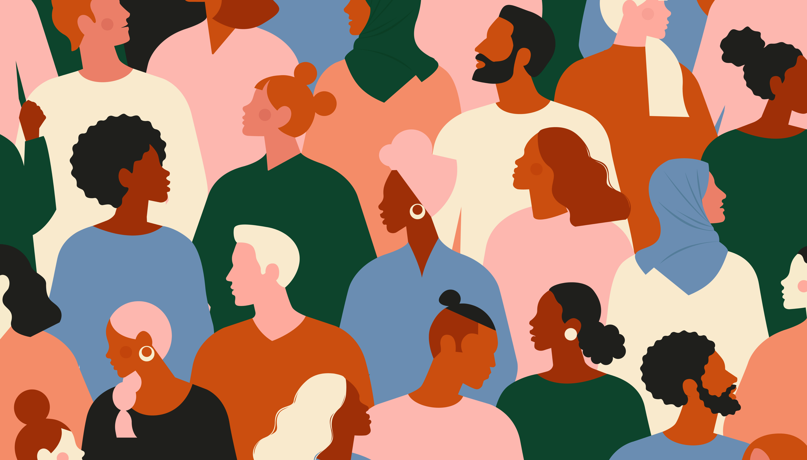

# HR-Diversity-Inclusion-Analysis

\
\

## Contents

-   [Description](#description)\
-   [Project Details](#project-details)\
-   [Repository Structure](#repository-structure)\
-   [Key Performance Indicators
    (KPIs)](#key-performance-indicators-kpis)
    -   [Calculated KPIs](#calculated-kpis)\
    -   [What is Diversity Percentage?](#what-is-diversity-percentage)\
    -   [What does Turnover mean?](#what-does-turnover-mean)\
-   [Data Collection](#data-collection)\
-   [Skills](#skills)\
-   [Tech Stack](#tech-stack)\
-   [Insights & Recommendations](#insights--recommendations)\
-   [Dashboard](#dashboard)\
-   [Conclusion](#conclusion)

------------------------------------------------------------------------

## Description

This project is part of the **PwC Power BI in Data Analytics Virtual
Case Experience**, where I analyzed the *Pharma Group AG* HR dataset
with a focus on **Diversity & Inclusion**.

The goal was to design a **Power BI dashboard** that provides executives
and HR managers with actionable insights into gender balance, hiring
trends, promotions, turnover, and employee performance.

By developing custom KPIs and interactive dashboards, this project
highlights opportunities to improve **representation, retention, and
fairness** within the organization.

------------------------------------------------------------------------

## Project Details

The analysis explored multiple dimensions of workforce diversity and
inclusion:\
- Employee distribution by **gender, age group, nationality, and
department**\
- **Hiring** patterns across departments, regions, and gender\
- **Promotion** analysis by level, gender, and department\
- **Turnover analysis**, including leavers by gender and performance
ratings\
- **Performance ratings** across departments, job levels, and retention
groups

This approach allowed for identifying areas where Pharma Group AG excels
and areas where targeted initiatives are needed.

------------------------------------------------------------------------

## Repository Structure

    ├── iCones/                          # Custom icons used in the dashboard  
    ├── images/                          # Screenshots of dashboards  
    │   ├── banner.png  
    │   ├── diversity-overview.png  
    │   ├── hiring-trends.png  
    │   ├── promotion-analysis.png  
    │   └── turnover-performance.png  
    ├── 03 Diversity-Inclusion-Dataset.xlsx   # Dataset provided for the analysis  
    ├── PWC - Pharma Group AG Diversity & Inclusion.pbix   # Power BI project file  
    ├── PWC - Pharma Group AG Diversity & Inclusion.pdf    # Exported report (PDF)  
    └── README.md                         # Documentation (this file)  

------------------------------------------------------------------------

## Key Performance Indicators (KPIs)

### Calculated KPIs

-   **Diversity Percentage (Female Workforce Representation)**\
-   **Employee Distribution by Gender**\
-   **New Hires (Male vs Female)**\
-   **Promotion Rates by Gender & Department**\
-   **Turnover %** = (Leavers ÷ Starting Headcount) × 100\
-   **Average Performance Ratings** by gender, job level, and leaver
    status

### What is Diversity Percentage?

The proportion of employees from a specific demographic group compared
to the total workforce.

> Diversity % (Females) = (Number of Female Employees ÷ Total Employees)
> × 100

### What does Turnover mean?

Turnover refers to the **rate at which employees leave the
organization**. High turnover can indicate low retention or
dissatisfaction, while low turnover reflects stability.

------------------------------------------------------------------------

## Data Collection

The dataset was provided in Excel format:\
- **File:** `03 Diversity-Inclusion-Dataset.xlsx`\
- **Source:** PwC Virtual Case Experience\
- **Size:** 500 employees\
- Includes: demographics, hiring, promotions, turnover, performance, and
departmental info.

------------------------------------------------------------------------

## Skills

-   Data Cleaning & Transformation\
-   DAX Calculations for KPIs\
-   Data Visualization & Storytelling\
-   HR Analytics (Diversity & Inclusion metrics)

------------------------------------------------------------------------

## Tech Stack

-   **Microsoft Excel** (Data Source)\
-   **Power Query** (ETL)\
-   **DAX** (KPI Formulas)\
-   **Microsoft Power BI** (Dashboard Design)

------------------------------------------------------------------------

## Insights & Recommendations

1.  **Gender Gap in Leadership**: Senior & executive positions are
    predominantly male → mentorship and leadership programs for women
    are recommended.\
2.  **Promotions Skewed by Gender**: Women have lower promotion rates in
    certain departments → review promotion criteria and support equity
    in advancement.\
3.  **Turnover Rate (\~9.4%)**: Women have slightly higher turnover than
    men → enhance employee engagement and retention strategies.\
4.  **Performance Ratings Balanced**: Average ratings are nearly
    identical between genders (2.42 women vs 2.41 men) → shows fair
    evaluation, but highlights need for raising overall performance
    standards.

------------------------------------------------------------------------

## Dashboard

📊 **Live Interactive Dashboard:** [View
Here](https://app.powerbi.com/view?r=eyJrIjoiZTRiNTljYjMtZTc4NC00YzJlLThkZTktMzkyNDc3ZmQ1ZWJjIiwidCI6Ijg0ZDI3MGQyLTBiYzUtNGQ1NS1iZjBhLTI3NGYxYTU3NmNiZiJ9)

### Dashboard Screenshots:

\
\
\

------------------------------------------------------------------------

## Conclusion

This **Diversity & Inclusion analysis for Pharma Group AG** demonstrates
how Power BI can provide HR leaders with deep insights into workforce
equality, turnover risks, and performance dynamics.

The dashboard acts as a strategic tool for shaping **inclusive
policies**, monitoring progress, and ensuring continuous improvement in
organizational culture.
